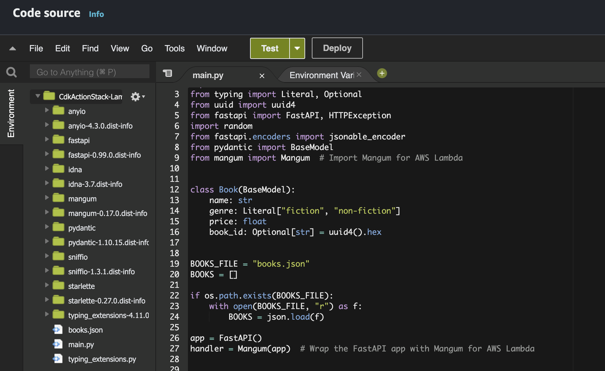

FastAPI docs: https://fastapi.tiangolo.com/

## (optional) Local Installation
```shell
pipenv install fastapi==0.99.0 mangum uvicorn
pipenv shell
> python 인터프리터 선택
uvicorn main:app --reload # chack if it works
(optional) pipenv run pip freeze > requirements.txt
```
fastapi 최신 버전에서 에러가 발생함 (2024.5.10. 현재)

## Propare to Deploy FastAPI to AWS Lambda
```shell
cd lambda
pipenv run pip install -t dependencies -r requirements.txt

(cd dependencies; zip ../aws_lambda_artifact.zip -r .)

zip aws_lambda_artifact.zip -u main.py
zip aws_lambda_artifact.zip -u books.json
```

lib/cdk-action-stack.ts
```typescript
...
 const lambdaFunction = new lambda.Function(this, 'LambdaFunction', {
      runtime: lambda.Runtime.PYTHON_3_12,
      code: lambda.Code.fromAsset('lambda/aws_lambda_artifact.zip'),
      handler: 'main.handler',
...
```

## Deploy FastAPI to AWS Lambda
```shell
git add .
git commit -m "Deploy FastAPI to AWS Lambda"
git push
```



https://youtu.be/7-CvGFJNE_o?si=6vDNWKTp2ZtmNWp8
